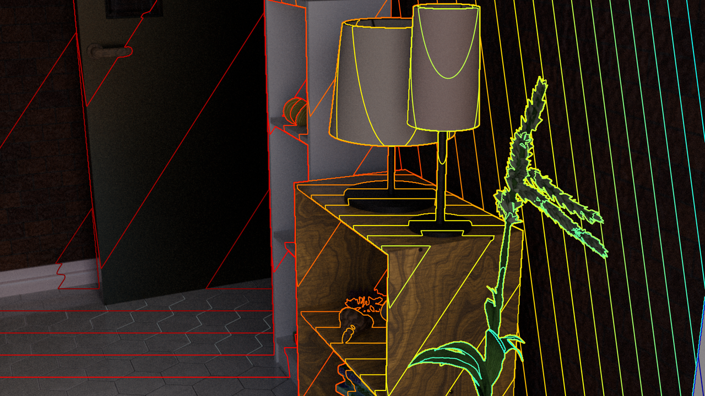
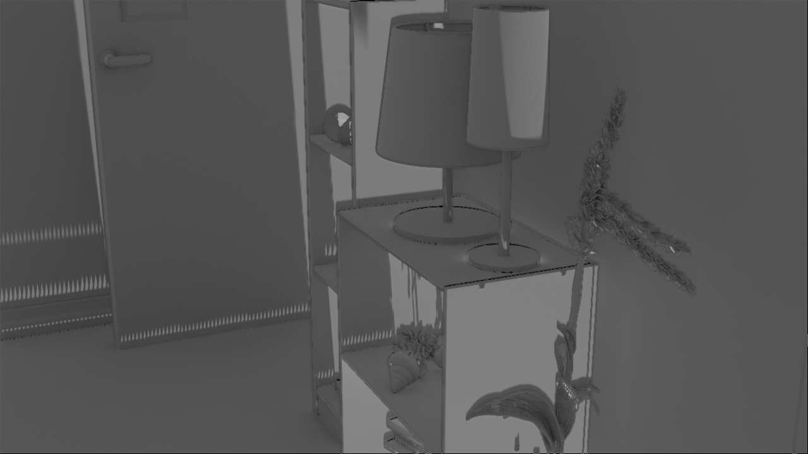

# How to evaluate monocular depth estimation?
This repository contains the source code for our paper:

[How to evaluate monocular depth estimation?](https://arxiv.org/abs/2510.19814)<br/>
[Siyang Wu](https://nj-wusiyang.github.io/), Jack Nugent, Willow Yang, [Jia Deng](https://www.cs.princeton.edu/~jiadeng/)

```
@article{wu2025evaluate,
  title={How Should One Evaluate Monocular Depth Estimation?},
  author={Wu, Siyang and Nugent, Jack and Yang, Willow and Deng, Jia},
  journal={arXiv preprint arXiv:2510.19814},
  year={2025}
}
```

## Installation Instructions
Under `EvalMDE`, run:
```bash
conda create -n evalmde python=3.10 -y
conda activate evalmde

pip install torch==2.7.0 torchvision==0.22.0 torchaudio==2.7.0 --index-url https://download.pytorch.org/whl/cu126
pip install -e .
pip install bpy==4.0.0 --extra-index-url https://download.blender.org/pypi/
```

## Data Format
### Depth map file
This repository takes depth map file in `*.npz` format, with keys: `depth, intr, valid`.
+ `depth`: `(H,W)`-shaped numpy array that stores depth value;
+ `intr`: `(4,)`-shaped numpy array that stores camera intrinsics `[fx, fy, cx, cy]`, where units are pixels;
+ `valid`: `(H,W)`-shaped boolean numpy array that stores whether the depth value of a pixel is valid (e.g. a pixel of `inf,nan` or extreme depth value is invalid).

`sample_data/gt_depth.npz`, `sample_data/curv_low_freq__0.200_10.0.npz`, `sample_data_2/gt_depth.npz`, `sample_data_2/depthpro_gt_focal.npz` provide examples of depth map files.
### Valid triangle (Required For Textureless Relighting Visualization)
In textureless relighting, we induce a textureless mesh from depth map and camera intrinsics. The mesh consists of triangle faces of vertices `(i,j), (i+1,j), (i,j+1)` and `(i+1,j+1), (i+1,j), (i,j+1)`.
Triangle faces across occlusion boundaries should be excluded.

`valid_triangle.npz` specifies which triangles are included (`True`) and which are not (`False`). 
It has keys: `valid_triangle`, which is a `(H-1,W-1,2)` shaped boolean numpy array, where `valid_triangle[i,j,0/1]` stands for whether `(i,j), (i+1,j), (i,j+1)` and `(i+1,j+1), (i+1,j), (i,j+1)` are included (`True`) or not included (`False`).
`sample_data/valid_triangle.npz` provides an example.

**Induce valid triangle from ground truth depth.** Valid triangle can be induced from ground truth depth by inducing occlusion boundaries by some heuristic.
In `induce_valid_triangle_from_gt_depth.py`, we provide an example script which detects occlusion boundaries by relative depth between neighboring pixels and set triangles across occlusion boundaries as invalid.
Running `python induce_valid_triangle_from_gt_depth.py` generates `sample_data_2/valid_triangle.npz`. 

## Compute Metric
Please refer to `compute_metrics_example.py`

## Visualization
### Projected Contours



```bash
ROOT=sample_data  # Path to directory where rgb.png is located
# ROOT=sample_data_2
DEPTH_F=gt_depth.npz  # Path to depth map to draw visualization, relative to $ROOT 
# DEPTH_F=curv_low_freq__0.200_10.0.npz  # when ROOT=sample_data
# DEPTH_F=depthpro_gt_focal.npz  # when ROOT=sample_data_2
python evalmde/visualization/render_contour_line.py $ROOT --depth_f $DEPTH_F
```
Running the above command generates projected contours visualization under `sample_data/contour_line` or `sample_data_2/contour_line`.
Projected contours of different densities along different axes are generated.
### Textureless Relighting



```bash
ROOT=sample_data  # Path to directory where rgb.png is located
# ROOT=sample_data_2
DEPTH_F=gt_depth.npz  # Path to depth map to draw visualization, relative to $ROOT 
# DEPTH_F=curv_low_freq__0.200_10.0.npz  # when ROOT=sample_data
# DEPTH_F=depthpro_gt_focal.npz  # when ROOT=sample_data_2
LIGHT_L=0  # specifies light direction
LIGHT_R=5  # specifies light direction
python evalmde/visualization/render_textureless_relighting.py $ROOT --depth_f $DEPTH_F --light_l $LIGHT_L --light_r $LIGHT_R
```
Running the above command generates textureless relighting visualization under `sample_data/visualization`.
By default, the script renders visualization using GPU. Add `--cpu` to run everything in cpu.

`ROT_LIGHT_NUM_LIGHT,ROT_LIGHT_NUM_LOOP` in `evalmde/visualization/__init__.py` specifies the light configuration. 
`ROT_LIGHT_NUM_LIGHT` locations of the source of directional light are equally spaced along the path that spirals up from `(0,0,-1)` to `(0,0,1)` along the surface of a unit sphere, rotating around `z`-axis for `ROT_LIGHT_NUM_LOOP` times.
Textureless mesh under the `i`-th source of directional light (`LIGHT_L<=i<LIGHT_R`) are rendered in the above command.

## Dataset
Dataset can be accessed [here](https://drive.google.com/drive/folders/1amzb6KyF2USFQ5W4CeYKFCh1F-yOQsmp?usp=sharing).

## Acknowledgments
This repository uses open source projects. We specially thank authors of [MoGe](https://github.com/microsoft/MoGe), [Marigold](https://github.com/prs-eth/Marigold), [DepthPro](https://github.com/apple/ml-depth-pro).